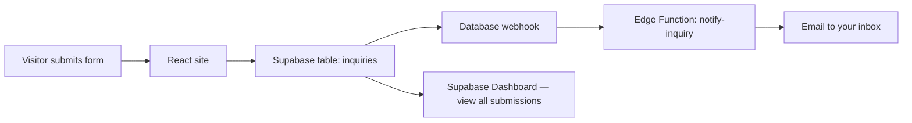

# Supabase setup guide

This site stores every **contact**, **quote**, and **career application** in Supabase. When someone submits a form, you get an **email alert** and a permanent record in the database.

## How it works (simple version)



1. **Frontend** (this repo) inserts a row into `inquiries` using the public **anon** key.
2. **Supabase** saves the row (storage).
3. **Database webhook** fires on `INSERT` and calls the **Edge Function**.
4. **Edge Function** sends you an email via [Resend](https://resend.com) (free tier works for low volume).

You can always open **Supabase Dashboard → Table Editor → inquiries** to see every submission even if email fails.

---

## Step 1 — Create a Supabase project

1. Go to [supabase.com](https://supabase.com) and create a project (free tier is fine).
2. Wait for the database to finish provisioning.

---

## Step 2 — Create the `inquiries` table

1. In Supabase: **SQL Editor → New query**
2. Paste the contents of `supabase/migrations/20260630000000_inquiries.sql`
3. Click **Run**

This creates the table and security rules:
- **Website visitors** can only **insert** (submit forms)
- **Nobody** can read submissions through the public website
- **You** (authenticated in dashboard) can read and mark as read/archived

---

## Step 3 — Connect the website

1. Supabase: **Project Settings → API**
2. Copy:
   - **Project URL** → `VITE_SUPABASE_URL`
   - **anon public** key → `VITE_SUPABASE_ANON_KEY`
3. In this repo, create `.env`:

```bash
cp .env.example .env
```

4. Fill in the Supabase values and restart the dev server:

```bash
npm run dev
```

5. For **Vercel/Netlify**, add the same two variables in the host’s environment settings and redeploy.

---

## Step 4 — Email notifications (Resend)

### 4a. Resend account

1. Sign up at [resend.com](https://resend.com)
2. Add and verify your domain (`prodsec.ca`) **or** use their test sender while testing
3. Create an API key

### 4b. Deploy the Edge Function

Install the [Supabase CLI](https://supabase.com/docs/guides/cli), then:

```bash
supabase login
supabase link --project-ref YOUR_PROJECT_REF
supabase functions deploy notify-inquiry
```

Set secrets for the function (Supabase Dashboard → **Edge Functions → notify-inquiry → Secrets**, or CLI):

| Secret | Example | Purpose |
|--------|---------|---------|
| `WEBHOOK_SECRET` | long random string | Required header for notify-inquiry (blocks forged calls) |
| `RESEND_API_KEY` | `re_...` | Sends email |
| `NOTIFY_FROM` | `Prodsec Website <noreply@prodsec.ca>` | From address (must be verified in Resend) |
| `NOTIFY_CONTACT_EMAIL` | `info@prodsec.ca` | Contact form alerts |
| `NOTIFY_QUOTE_EMAIL` | `sean@prodsec.ca` | Quote form alerts |
| `NOTIFY_CAREERS_EMAIL` | `elie@prodsec.ca` | Career application alerts |

### 4c. Database webhook (triggers email on every new row)

1. Supabase: **Database → Webhooks → Create a new hook**
2. **Name:** `notify-on-inquiry`
3. **Table:** `inquiries`
4. **Events:** `Insert`
5. **Type:** Supabase Edge Function
6. **Function:** `notify-inquiry`
7. **HTTP Headers:** add `x-webhook-secret` = same value as the `WEBHOOK_SECRET` function secret
8. Save

Submit a test form on `/contact` — you should see a row in the table and receive an email within seconds.

---

## Step 5 — View submissions day to day

**Option A — Supabase Dashboard (easiest)**  
Table Editor → `inquiries` → sort by `created_at`

**Option B — SQL**  
```sql
select created_at, type, name, email, subject, status
from inquiries
where status = 'new'
order by created_at desc;
```

**Option C — Future admin panel**  
Because data lives in Supabase, you can later build a small internal React app with Supabase Auth — same database, no migration needed.

---

## Email routing

| Form page | `type` in database | Default notify email |
|-----------|-------------------|----------------------|
| `/contact` | `contact` | info@prodsec.ca |
| `/quote` | `quote` | sean@prodsec.ca |
| `/careers/jobs/apply` | `career` | elie@prodsec.ca |

Change these with the `NOTIFY_*_EMAIL` Edge Function secrets.

---

## Troubleshooting

| Problem | Fix |
|---------|-----|
| Form says Supabase not configured | Add `VITE_SUPABASE_*` to `.env` and restart dev server |
| Form submits but no email | Check Edge Function logs; verify webhook exists; check Resend API key and verified sender |
| `new row violates row-level security` | Re-run the migration SQL; confirm anon insert policy exists |
| Works locally, fails in production | Add env vars on Vercel/Netlify and redeploy |

---

## Why Supabase instead of Web3Forms?

- **Storage:** every submission is saved — searchable, exportable, never lost in spam
- **You already know it:** same Postgres + dashboard you use elsewhere
- **Grow later:** add file uploads (Storage), admin UI, or automations without changing the frontend much

The **anon key is safe in the browser** because RLS only allows inserts, not reads.
